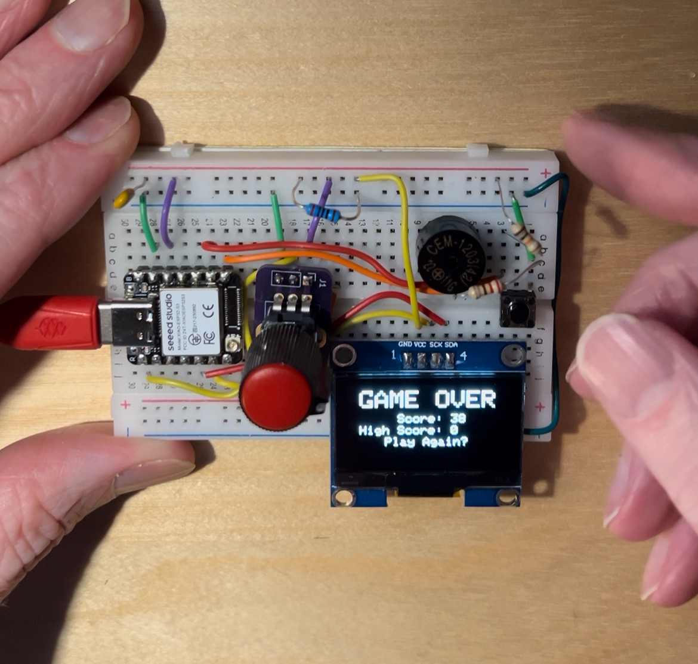

# esp32-space-drop
Space Drop Game (by Chad Kapper) ported to ESP32

## Hardware Setup

- ESP32S3 or similar XIAO board
- SH1106 type OLED connected to SDA,SCL
- buttonPin1 D7 (button should connect to GND when pressed, add a 10k pullup)
- 10k pot A0 (connect wiper of pot to A0, other two pins to GND and VCC)
- buzzer/speaker D8 (connect with a series resistor around 100-220ohm)

## Parts List

**Reference**|**Value**|**Package**
:-----:|:-------------:|:-------------:
C1|0.1uF|Cer. Capacitor
R1|220|Resistor
R2|10K|Resistor
SP1|8-32ohm|12mm
SW1|SPST|BF-6
VR1|10K|3-pin
MCU|Seeed ESP32S3|custom
OLED|128x64 pixels,I2C|0.96in

## Software Setup

Add the sketch to your Arduino IDE.

You may need to add the following libraries:

- Adafruit_GFX_Library
- Adafruit_SH110x

Also, you may need to add the board profile for your particular board.
The ESP32S3 board needs this library:
- esp32 (by Espressif Systems, I installed v3.3.6)
